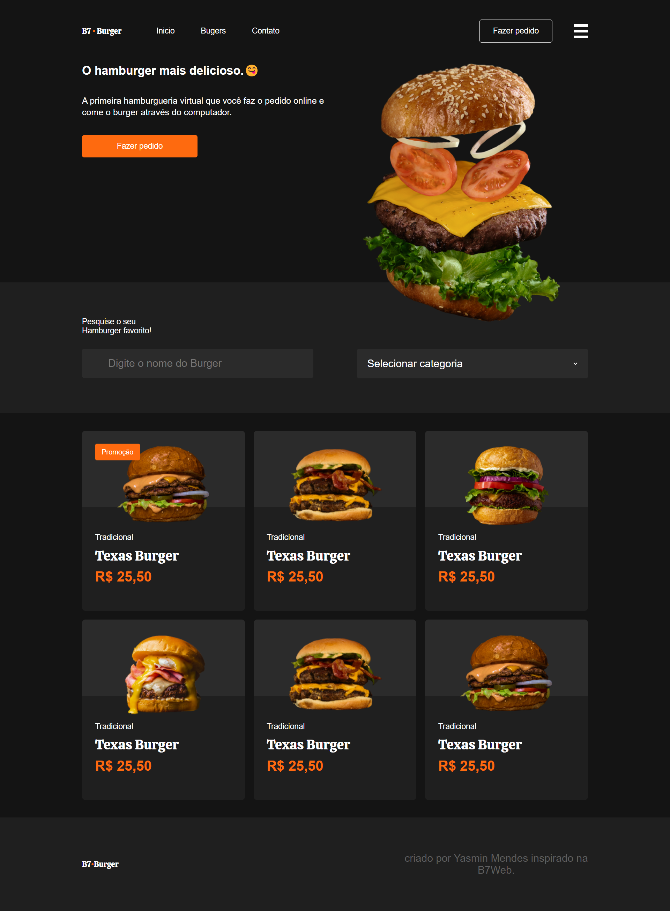

<h1 align="center">B7BURGER</h1>

  <a href="#-tecnologias">Tecnologias</a>&nbsp;&nbsp;&nbsp;|&nbsp;&nbsp;&nbsp;
  <a href="#-projeto">Projeto</a>&nbsp;&nbsp;&nbsp;|&nbsp;&nbsp;&nbsp;
  <a href="#memo-licença">Licença</a>

  

 

  

## 🚀 Tecnologias

Esse projeto foi desenvolvido com as seguintes tecnologias:

- HTML
- CSS

## 💻 Projeto

Projeto pratico do curso B7WEB de uma hamburgueria virtual, com um layout simples e direto ao ponto. Ele permite que os usuários naveguem pelas opções de hambúrgueres, façam pedidos e explorem as promoções. A ideia de ser uma hamburgueria virtual, onde o pedido é feito online, é destacada na seção hero, criando um tom descontraído e moderno para o site.

## :memo: Licença

Esse projeto está sob a licença MIT.
